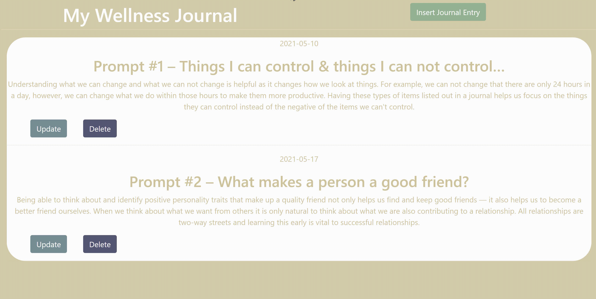

# Wellness-Journal-API
This Personal Journal App with a Flask backend and a ReactJS frontend is here to help you meet your journaling needs and goals. Reflect on an inspirational quote, respond to a journaling prompt, write down some personal goals, the possibilities are endless.

Users can create journal entries

 

update entries

 

and delete entries.

 
